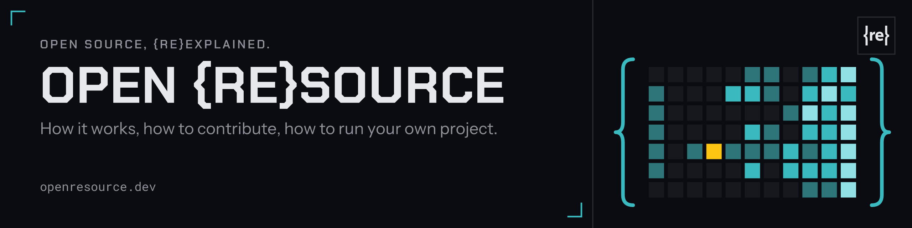

<a href="https://openresource.dev"><picture><source srcset="header.svg" type="image/svg+xml"></picture></a>

<h1 align="center">Welcome to the <a href="https://openresource.dev/">Open {re}Source</a> community!</h1>

  <b>Open source, {re}explained.</b>
   
  How it works, how to contribute, how to run your own project.
   
  A free guide, articles and a showcase by the Open {re}Source community.

  <a href="https://openresource.dev">Open {re}Source website</a>
  ·
  <a href="https://discord.gg/fpUDwEMGwE">Discord</a>
  ·
  <a href="https://bsky.app/profile/openresource.dev">Bluesky</a>
  ·
  <a href="https://x.com/open_resource">X</a>

## Sponsors

  

The Open {re}Source mark and header image are not under an open licence: all rights reserved.
